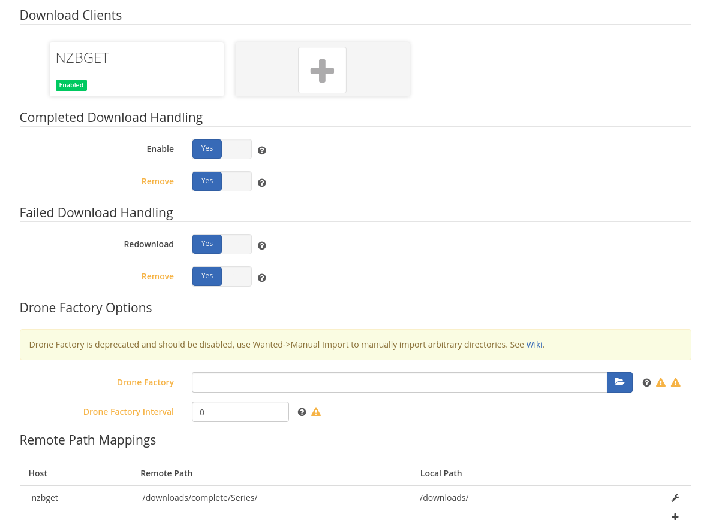
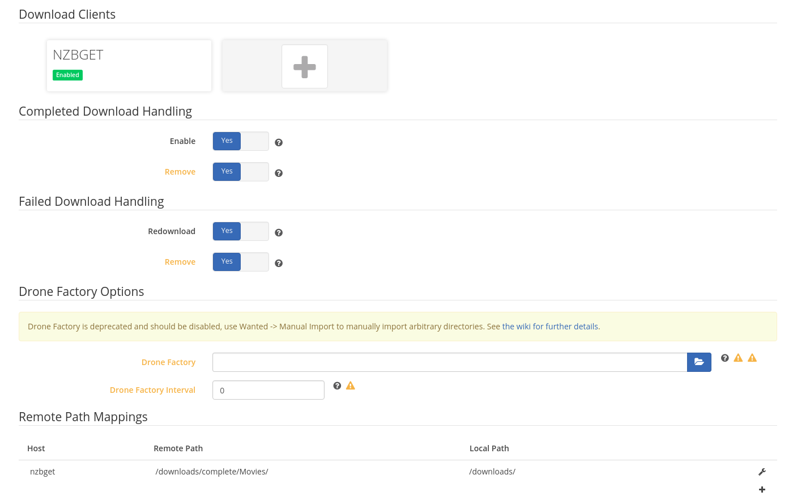

# Fully Dockerized Media-Stack

This main purpose of this project is to provide an easy, distributable, set of containers run in Docker, for the purposes of finding, downloading, and playing Media files.

## Built With

The project consists of a docker-compose file utilizing the following opensource software components:

 * [nzbget](https://nzbget.net) - Downloader for usenet
 * [sonarr](https://sonarr.tv) - Searcher and handler for TV episodes
 * [radarr](https://radarr.video) - Searcher and handler for Movies
 * [plex](https://www.plex.tv) - Media Management for multiple devices etc
 * [plexpy](https://jonnywong16.github.io/plexpy/) - Monitoring and tracking information for Plex

Each of these is fully containerized and easily setup, with some simple volume and network configurations.

## Requirements

 1 - A host machine running Docker - I use an Ubuntu installation on a Mac Mini
 2 - Docker and Docker Compose
 3 - Git
 4 - Somewhere to store Media files and configurations - I use a NAS and connect over NFS
 5 - My current setup uses the Plexpass tagged container for Plex - If you do NOT have Plexpass you may need to use an alternative image

## Installing

 * Install Docker on your machine
 * Clone this repository - `git clone https://github.com/arctiqtim/media-stack`
 * Ensure you've setup your Media store

## Configuration

 * Edit the `docker-compose.yml` file in the cloned repo accordingly - **Most Importantly** edit the volume mappings
 * Ensure all volume mounts are customized - **For Plex you need a non-NAS mount point for its configuration files**
 * Customize network ports accordingly - This default setup uses ports 27020, 27021, 27022, and 27023
 * Customize User and Group IDs according to your Media storage setup.  The defaults in the included file may work

In order to ensure the Sonarr and Radarr containers can find downloaded media from Nzbget properly you need to configure them as follows:

### Sonarr Configuration - Advanced Settings in "Download Client"

### Radarr Configuration - Advanced Settings in "Download Client"

## License

This project is licensed under the MIT License - see the [LICENSE.md](LICENSE.md) file for details

## Acknowledgments

* [LinuxServer.io](https://www.linuxserver.io) - All container images with the exception of Plex have been contributed by the folks at LinuxServer.io
* [Plex](www.plex.tv) - The media manager / hub of choice
